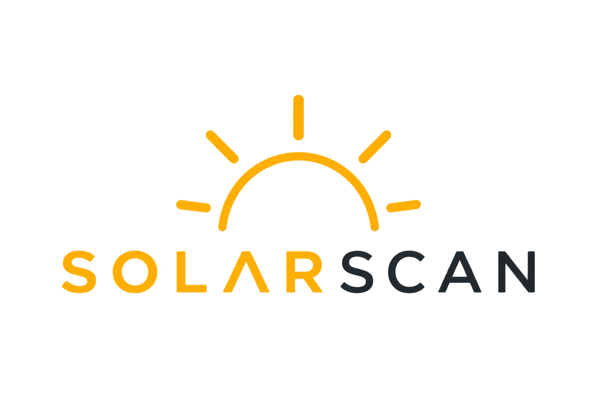

<div align="center">
  
  <h1>SolarScan 🛰️☀️</h1>
  <p><strong>Logiciel professionnel de détection de panneaux solaires par imagerie satellite pour la facturation de nettoyage.</strong></p>
</div>

---

## 📋 Présentation

**SolarScan** est une application desktop (Windows, macOS, Linux) pensée pour les professionnels du nettoyage de panneaux photovoltaïques. Grâce à l'imagerie satellite haute résolution de l'IGN et à une intelligence artificielle intégrée, l'application est capable de détecter automatiquement les panneaux solaires sur les toits et de générer instantanément des devis professionnels complets.

> ⚠️ **Couverture géographique : France uniquement** — L'imagerie haute résolution IGN Géoplateforme couvre exclusivement la France métropolitaine et les DOM-TOM.

---

## ✨ Fonctionnalités Principales

*   🗺️ **Navigation et Imagerie IGN Haute Résolution** : Visualisez n'importe quelle adresse en France grâce au fond de carte de l'IGN.
*   🔍 **Barre de Recherche Intelligente** : Entrez directement une adresse comme sur Google Maps pour y accéder en une fraction de seconde.
*   🤖 **Détection Automatique (IA)** : Scannez la zone visible ou dessinez manuellement une zone à analyser. L'algorithme détecte les panneaux, dessine leurs contours et calcule leur surface en $m^2$.
*   💶 **Tarification Intelligente par Paliers** : Configurez jusqu'à 4 paliers de facturation selon la surface (ex: 3,50€/m² jusqu'à 100m², 3,00€/m² jusqu'à 300m²...). L'application applique automatiquement le bon prix à chaque panneau.
*   📄 **Génération de Devis PDF Professionnels** : 
    *   Devis design et premium à l'image de votre société.
    *   **Géocodage inverse** : l'adresse du client est automatiquement trouvée grâce aux coordonnées GPS des panneaux.
    *   Aperçu satellite annoté inclus dans le devis.
    *   **Filigrane transparent** (votre logo) élégamment placé au centre du PDF pour prouver l'authenticité de vos devis.
*   📊 **Export CSV Compatible Excel FR** : Exportez la liste complète des détections avec un CSV dont le formatage est parfaitement adapté au marché français (séparateurs en point-virgule, virgules décimales, accents UTF-8 gérés).
*   🏢 **Personnalisation** : Importez votre propre logo, configurez le nom, l'adresse, le SIRET de votre société, et votre taux de TVA.

---

## 🚀 Installation & Lancement

L'application est divisée en deux parties : un backend (Python) pour le moteur de détection et l'accès réseau, et un frontend (Electron) pour l'interface utilisateur.

### 1. Prérequis
*   **Node.js** (v18.x LTS) & **npm** (v9.x)
*   **Python** (v3.10+)

### 2. Installation
Ouvrez votre terminal à la racine du projet et installez les dépendances :

```bash
# Frontend (Electron)
cd electron
npm install
cd ..

# Backend (Python)
cd backend
python3 -m venv venv
source venv/bin/activate      # Sur macOS/Linux
# venv\Scripts\activate       # Sur Windows
pip install -r requirements.txt
cd ..
```

### 3. Lancement
Pour lancer le logiciel en mode développement, vous devez ouvrir **deux terminaux** :

**Terminal 1 — Le Moteur (Backend)**
```bash
cd backend
source venv/bin/activate
uvicorn main:app --host 127.0.0.1 --port 8765 --reload
```

**Terminal 2 — L'Interface (Frontend)**
```bash
cd electron
npm start
```

---

## 📖 Mode d'emploi

1. **Régler vos paramètres** : Cliquez sur l'engrenage (⚙) en haut à droite. Importez le logo de votre société et configurez vos grilles tarifaires.
2. **Trouver un client** : Utilisez la barre de recherche au centre pour taper l'adresse du client.
3. **Scanner** : Une fois sur le toit du client (zoomez bien fort pour la précision), cliquez sur le bouton bleu **"🔍 Scanner"**.
4. **Générer le devis** : Le menu de droite s'ouvre avec le total calculé. Cliquez sur **Export PDF**. L'adresse se remplit toute seule, vérifiez-la, et cliquez sur **Générer le PDF**.
5. C'est fait ! Votre dossier "Téléchargements" s'ouvrira automatiquement pour vous montrer le devis terminé.

---

## 🛠️ Architecture Technique

*   **Frontend** : HTML5, CSS3 Natif (Design System sur-mesure ultra-léger), JavaScript (Vanilla), Leaflet (Cartographie), Electron (Moteur desktop).
*   **Backend** : FastAPI (Python), OpenStreetMap Nominatim (Géocodage inverse & Recherche).
*   **Système d'exports** : `printToPDF` (Chromium Electron) générant les documents vectoriels, exports CSV formattés sur-mesure en UTF-8 BOM.

---

<div align="center">
  <p>© 2024 SolarScan — Développé pour la rentabilité et l'élégance.</p>
</div>
